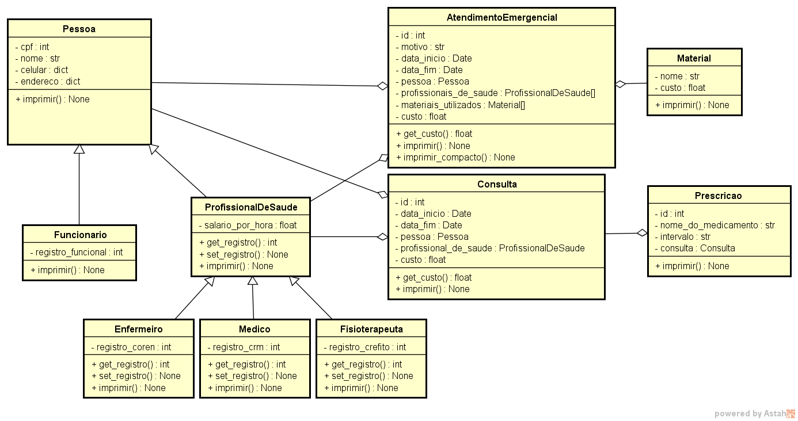

[![MIT License][license-shield]][license-url]
[![LinkedIn][linkedin-shield]][linkedin-url]

<!-- PROJECT LOGO -->

<h3 align="center">Sistema Hospitalar</h3>

  

    Projeto final da disciplina Programação Orientada a Objetos I
     
  

<!-- TABLE OF CONTENTS -->

  
Tabela de Conteúdos

  <ol>
    <li>
      <a href="#sobre">Sobre</a>
    </li>
    <li><a href="#licença">Licença</a></li>
    <li><a href="#contato">Contato</a></li>
    <li><a href="#agradecimentos">Agradecimentos</a></li>
  </ol>

<!-- ABOUT THE PROJECT -->

## Sobre

O objetivo deste sistema está em controlar alguns procedimentos hospitalares, principalmente as consultas e os
atendimentos de emergência.

O sistema cadastra e permite a visualização, alteração e exclusão de pessoas (pessoas comuns, funcionários e
profissionais de saúde), consultas, prescrições (realizadas somente por médicos após consultas), atendimentos
emergenciais e materiais hospitalares (que podem ser utilizados nos atendimentos emergenciais). Além disso, também
calcula automaticamente o preço das consultas e dos atendimentos emergenciais.

<!-- LICENSE -->

## Licença

Distribuído sob a Licença MIT. Veja `LICENSE.txt` para mais informações.

<!-- CONTACT -->

## Contato

Fabricio Duarte Júnior - fabricio.duarte.jr@gmail.com

<!-- ACKNOWLEDGMENTS -->

## Agradecimentos

* [Best-README-Template](https://github.com/othneildrew/Best-README-Template/)

<!-- MARKDOWN LINKS & IMAGES -->

[license-shield]: https://img.shields.io/github/license/winterhazel/sistema-hospitalar.svg?style=for-the-badge

[license-url]: https://github.com/winterhazel/sistema-hospitalar/blob/main/LICENSE.txt

[linkedin-shield]: https://img.shields.io/badge/-LinkedIn-black.svg?style=for-the-badge&logo=linkedin&colorB=555

[linkedin-url]: https://linkedin.com/in/fabricio-duarte-júnior-676601231
